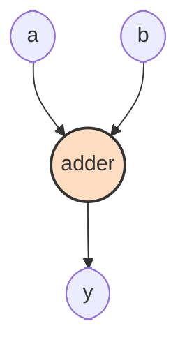

# adder

```mermaid
flowchart TD
    classDef main fill:#FFDDC1,stroke:#333,stroke-width:2px
    classDef sub fill:#BBE1FA,stroke:#333
    a([a]) --> adder_module((adder))
    b([b]) --> adder_module
    adder_module --> y([y])
    class adder_module main
```
