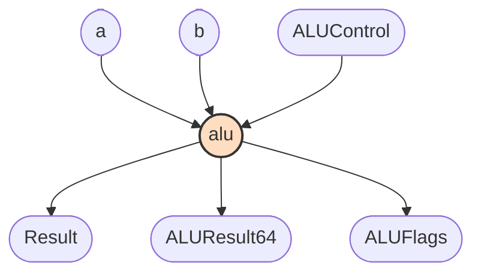

# alu

```mermaid
flowchart TD
    classDef main fill:#FFDDC1,stroke:#333,stroke-width:2px
    classDef sub fill:#BBE1FA,stroke:#333
    a([a]) --> alu_module((alu))
    b([b]) --> alu_module
    ALUControl([ALUControl]) --> alu_module
    alu_module --> Result([Result])
    alu_module --> ALUResult64([ALUResult64])
    alu_module --> ALUFlags([ALUFlags])
    class alu_module main
```
