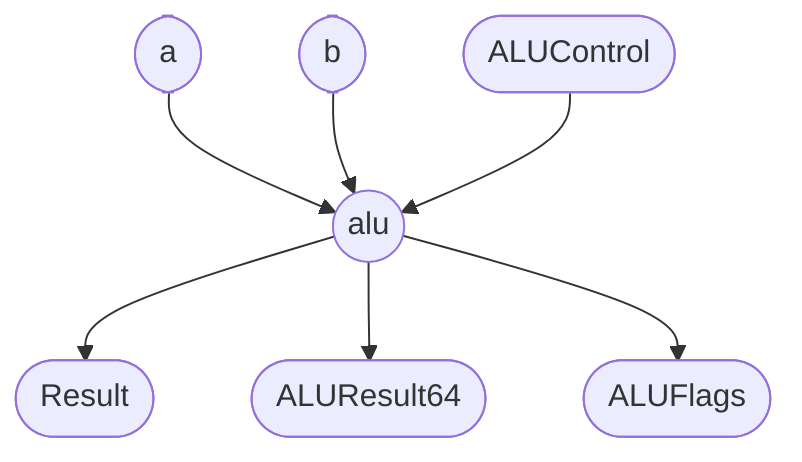

# alu

```mermaid
flowchart TD
    a([a]) --> alu_module((alu))
    b([b]) --> alu_module
    ALUControl([ALUControl]) --> alu_module
    alu_module --> Result([Result])
    alu_module --> ALUResult64([ALUResult64])
    alu_module --> ALUFlags([ALUFlags])
```
