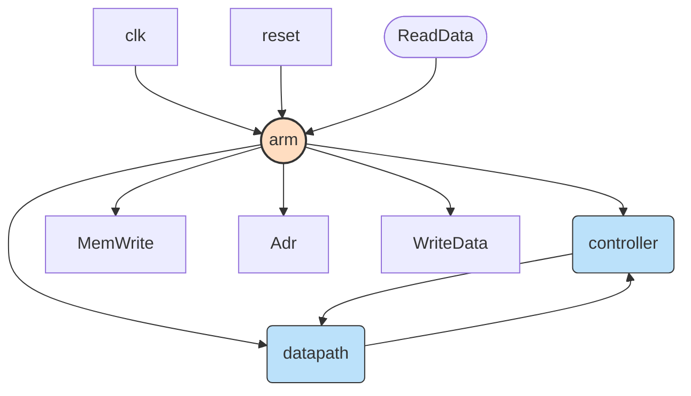

# arm

```mermaid
flowchart TD
    classDef main fill:#FFDDC1,stroke:#333,stroke-width:2px
    classDef sub fill:#BBE1FA,stroke:#333
    clk --> arm_module((arm))
    reset --> arm_module
    ReadData([ReadData]) --> arm_module
    arm_module --> controller_sub(controller)
    arm_module --> datapath_sub(datapath)
    controller_sub --> datapath_sub
    datapath_sub --> controller_sub
    arm_module --> MemWrite
    arm_module --> Adr
    arm_module --> WriteData
    class arm_module main
    class controller_sub,datapath_sub sub
```
