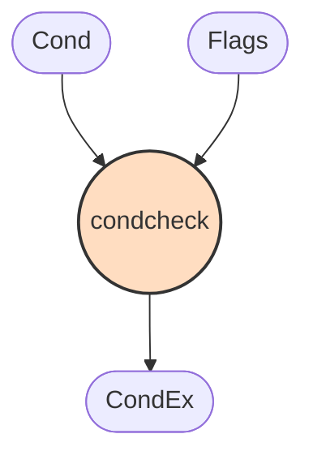

# condcheck

```mermaid
flowchart TD
    classDef main fill:#FFDDC1,stroke:#333,stroke-width:2px
    classDef sub fill:#BBE1FA,stroke:#333
    Cond([Cond]) --> cc((condcheck))
    Flags([Flags]) --> cc
    cc --> CondEx([CondEx])
    class cc main
```
