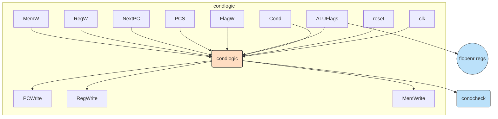

# condlogic

```mermaid
flowchart TD
    classDef main fill:#FFDDC1,stroke:#333,stroke-width:2px
    classDef sub fill:#BBE1FA,stroke:#333
    subgraph condlogic
        clk --> cl
        reset --> cl
        Cond --> cl
        ALUFlags --> cl
        FlagW --> cl
        PCS --> cl
        NextPC --> cl
        RegW --> cl
        MemW --> cl
        cl(condlogic)
        cl --> PCWrite
        cl --> RegWrite
        cl --> MemWrite
    end
    cl --> condcheck_sub(condcheck)
    ALUFlags --> flags_regs((flopenr regs))
    class cl main
    class condcheck_sub,flags_regs sub
```
