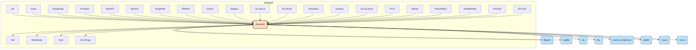

# datapath

```mermaid
flowchart TD
    classDef main fill:#FFDDC1,stroke:#333,stroke-width:2px
    classDef sub fill:#BBE1FA,stroke:#333
    subgraph datapath
        clk --> dp
        reset --> dp
        ReadData --> dp
        PCWrite --> dp
        NextPC --> dp
        Branch --> dp
        RegWrite --> dp
        IRWrite --> dp
        AdrSrc --> dp
        RegSrc --> dp
        ALUSrcA --> dp
        ALUSrcB --> dp
        ResultSrc --> dp
        ImmSrc --> dp
        ALUControl --> dp
        PCS --> dp
        WAsel --> dp
        ResultWEn --> dp
        AandBWrite --> dp
        RA2Sel --> dp
        FPUOp --> dp
        dp(datapath)
        dp --> Adr
        dp --> WriteData
        dp --> Instr
        dp --> ALUFlags
    end
    dp --> flopenr_pc(flopenr)
    dp --> regfile_sub(regfile)
    dp --> alu_sub(alu)
    dp --> fpu_sub(fpu)
    dp --> extend_sub(extend_rotational)
    dp --> adder_sub(adder)
    dp --> mux2_sub(mux2)
    dp --> mux3_sub(mux3)
    class dp main
    class flopenr_pc,regfile_sub,alu_sub,fpu_sub,extend_sub,adder_sub,mux2_sub,mux3_sub sub
```
