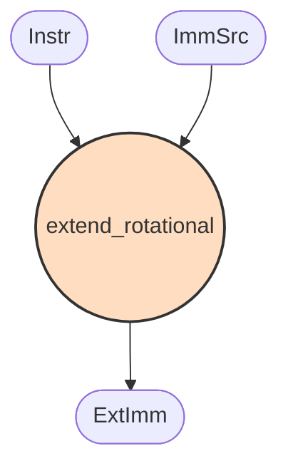

# extend_rotational

```mermaid
flowchart TD
    classDef main fill:#FFDDC1,stroke:#333,stroke-width:2px
    classDef sub fill:#BBE1FA,stroke:#333
    Instr([Instr]) --> ext_mod((extend_rotational))
    ImmSrc([ImmSrc]) --> ext_mod
    ext_mod --> ExtImm([ExtImm])
    class ext_mod main
```
