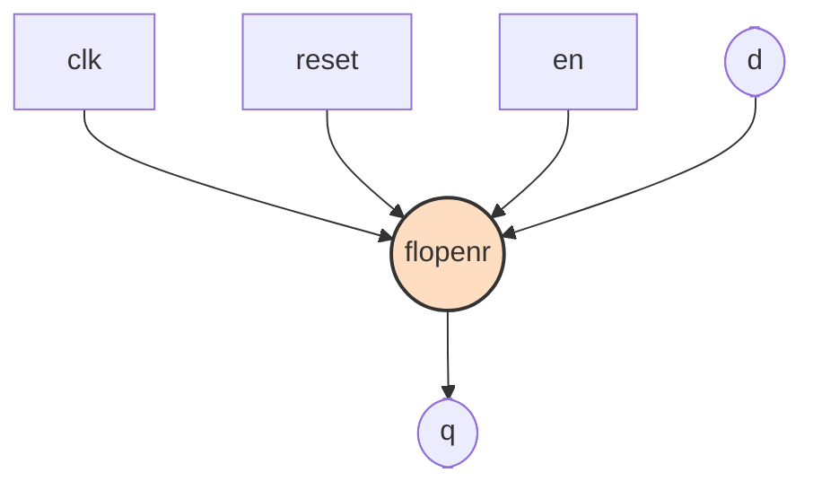

# flopenr

```mermaid
flowchart TD
    classDef main fill:#FFDDC1,stroke:#333,stroke-width:2px
    classDef sub fill:#BBE1FA,stroke:#333
    clk --> flopenr_module((flopenr))
    reset --> flopenr_module
    en --> flopenr_module
    d([d]) --> flopenr_module
    flopenr_module --> q([q])
    class flopenr_module main
```
