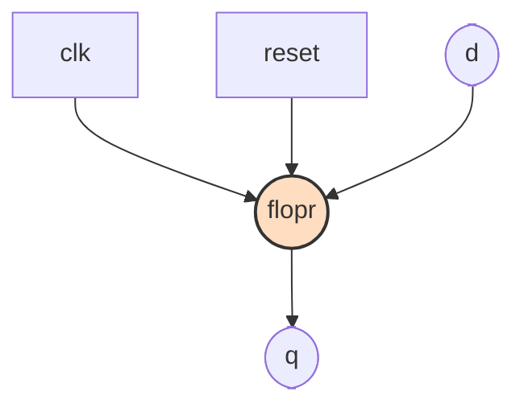

# flopr

```mermaid
flowchart TD
    classDef main fill:#FFDDC1,stroke:#333,stroke-width:2px
    classDef sub fill:#BBE1FA,stroke:#333
    clk --> flopr_module((flopr))
    reset --> flopr_module
    d([d]) --> flopr_module
    flopr_module --> q([q])
    class flopr_module main
```
