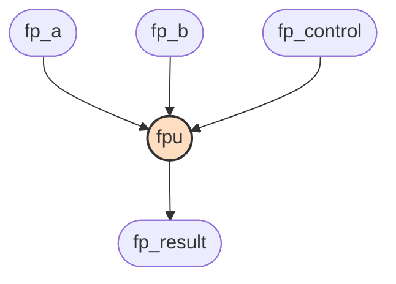

# fpu

```mermaid
flowchart TD
    classDef main fill:#FFDDC1,stroke:#333,stroke-width:2px
    classDef sub fill:#BBE1FA,stroke:#333
    fp_a([fp_a]) --> fpu_module((fpu))
    fp_b([fp_b]) --> fpu_module
    fp_control([fp_control]) --> fpu_module
    fpu_module --> fp_result([fp_result])
    class fpu_module main
```
