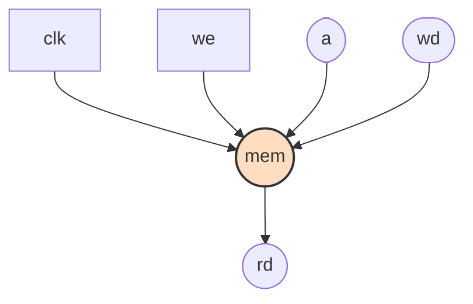

# mem

```mermaid
flowchart TD
    classDef main fill:#FFDDC1,stroke:#333,stroke-width:2px
    classDef sub fill:#BBE1FA,stroke:#333
    clk --> mem_module((mem))
    we --> mem_module
    a([a]) --> mem_module
    wd([wd]) --> mem_module
    mem_module --> rd([rd])
    class mem_module main
```
