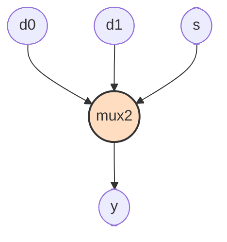

# mux2

```mermaid
flowchart TD
    classDef main fill:#FFDDC1,stroke:#333,stroke-width:2px
    classDef sub fill:#BBE1FA,stroke:#333
    d0([d0]) --> mux2_module((mux2))
    d1([d1]) --> mux2_module
    s([s]) --> mux2_module
    mux2_module --> y([y])
    class mux2_module main
```
