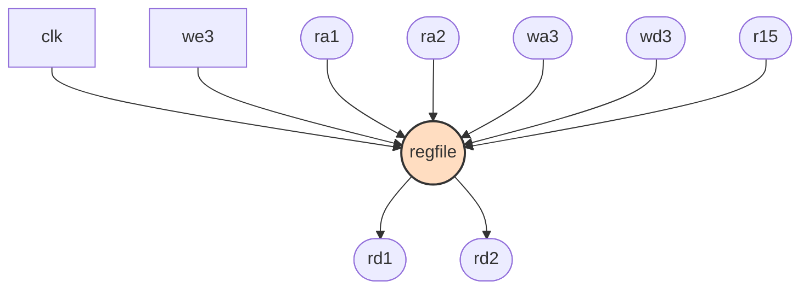

# regfile

```mermaid
flowchart TD
    classDef main fill:#FFDDC1,stroke:#333,stroke-width:2px
    classDef sub fill:#BBE1FA,stroke:#333
    clk --> regfile_module((regfile))
    we3 --> regfile_module
    ra1([ra1]) --> regfile_module
    ra2([ra2]) --> regfile_module
    wa3([wa3]) --> regfile_module
    wd3([wd3]) --> regfile_module
    r15([r15]) --> regfile_module
    regfile_module --> rd1([rd1])
    regfile_module --> rd2([rd2])
    class regfile_module main
```
