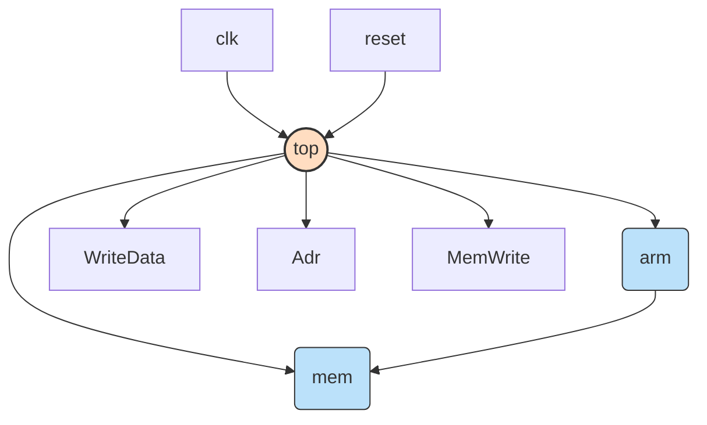

# top

```mermaid
flowchart TD
    classDef main fill:#FFDDC1,stroke:#333,stroke-width:2px
    classDef sub fill:#BBE1FA,stroke:#333
    clk --> top_module((top))
    reset --> top_module
    top_module --> arm_sub(arm)
    top_module --> mem_sub(mem)
    arm_sub --> mem_sub
    top_module --> WriteData
    top_module --> Adr
    top_module --> MemWrite
    class top_module main
    class arm_sub,mem_sub sub
```
