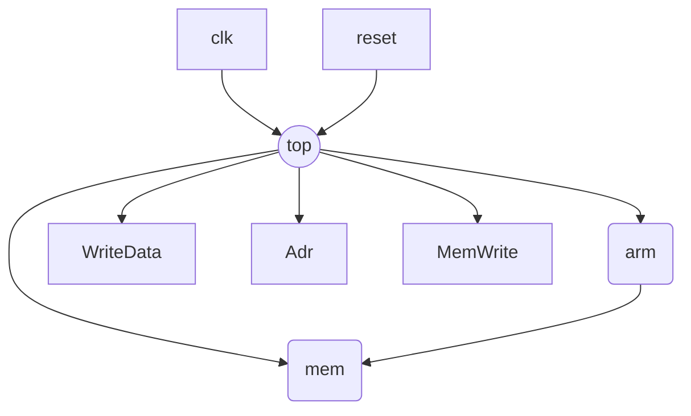

# top

```mermaid
flowchart TD
    clk --> top_module((top))
    reset --> top_module
    top_module --> arm_sub(arm)
    top_module --> mem_sub(mem)
    arm_sub --> mem_sub
    top_module --> WriteData
    top_module --> Adr
    top_module --> MemWrite
```
